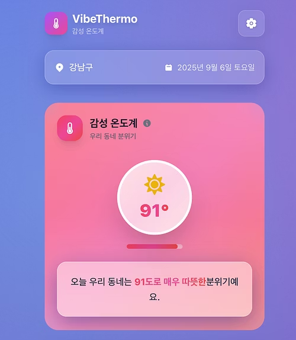

# VibeThermo - AI 동네 감성 온도계 🌡️

> 매일 아침, AI가 요약해주는 핵심 동네소식 브리핑 서비스

## 💡 프로젝트 소개

바쁜 현대인을 위해 매일 아침 AI가 우리 동네의 주요 소식을 요약해서 브리핑해주는 서비스입니다.

흩어져 있는 지역 정보를 한곳에 모아, 사용자가 동네의 중요한 일을 놓치지 않도록 돕는 것을 목표로 합니다.

## 🎥 데모 사진

  
  

## ✨ 주요 기능

- **위치 기반 서비스**: 사용자의 현재 위치를 기반으로 해당 지역의 뉴스, 날씨, 맛집 정보를 자동으로 제공합니다.
- **AI 뉴스 요약**: 크롤링된 최신 뉴스들을 AI가 분석하여 핵심만 3줄로 요약해주는 브리핑 기능을 제공합니다.
- **감성 분석 시각화**: '감성 온도계' 기능을 통해 동네의 긍정/부정 이슈 비율을 시각적으로 파악할 수 있습니다.
- **실시간 정보 제공**: 날씨, 맛집 등 생활에 밀접한 정보를 실시간으로 제공합니다.

## 📱 예상 사용 사례

### 🌅 아침 출근길 시나리오
**김직장인 (강남구 거주)**
- 오전 7시, 출근 준비 중 바이브써모 앱 확인
- "오늘 강남구는 미세먼지 나쁨, 마스크 필수!" 알림 확인
- 지하철 2호선 지연 소식과 대체 교통편 정보 획득
- 점심 약속 장소 근처 새로 오픈한 맛집 3곳 추천받음

### 🏠 주말 동네 탐방 시나리오
**박가족 (마포구 거주)**
- 토요일 오전, 가족과 동네 나들이 계획
- 마포구 감성 온도계 확인: "따뜻한 날씨 🌤️ (긍정 지수 +75°)"
- 홍대 근처 핫플 카페와 아이와 함께 갈 만한 체험 공간 정보 확인
- 구청에서 진행하는 주말 가족 이벤트 소식 발견

### 🏢 신규 이사 시나리오
**이신입 (송파구 신규 거주자)**
- 새 동네 정착을 위한 정보 수집 필요
- 송파구 주요 이슈와 동네 분위기 파악
- 근처 병원, 마트, 맛집 등 생활 인프라 정보 확인
- 동네 주민들이 자주 이용하는 커뮤니티 공간 발견

## ⚙️ 아키텍처

Next.js 기반의 프론트엔드에서 사용자의 요청을 받으면, AWS Lambda에 배포된 NestJS 백엔드가 이를 처리합니다. 데이터 크롤링 및 처리는 Python 기반의 Lambda 함수와 EventBridge를 통해 주기적으로 실행되며, 모든 데이터는 AWS RDS(PostgreSQL)에 저장됩니다.

## 🛠️ 기술 스택

### Frontend
- `Next.js`
- `React`
- `TypeScript`
- `Tailwind CSS`

### Backend
- `NestJS`
- `Python`
- `Amazon Bedrock (Claude)`

### Database
- `PostgreSQL (on AWS RDS)`

### Deployment & Infra
- `AWS Lambda`
- `AWS EventBridge`
- `AWS S3`
- `Docker`