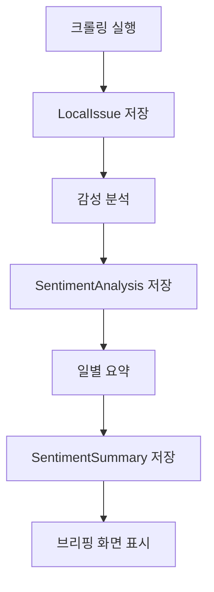

# LocalBriefing 데이터베이스 현황

**조회 일시**: 2025-01-09  
**데이터베이스**: SQLite (db.sqlite3)  
**상태**: 마이그레이션 완료, 데이터 없음

## 1. 테이블 구조

### 1.1 핵심 테이블
- **locations** - 지역 정보 (서울시 25개 구)
- **local_issues** - 동네 이슈 데이터 (유튜브, 네이버 뉴스/검색)
- **sentiment_analysis** - 감성 분석 결과
- **sentiment_summary** - 일별 감성 요약
- **district_announcements** - 구청 공지사항
- **restaurant_info** - 음식점 정보
- **raw_data** - 원시 크롤링 데이터

### 1.2 Django 시스템 테이블
- **django_content_type** - Django 콘텐츠 타입
- **django_migrations** - 마이그레이션 기록
- **django_session** - 세션 데이터

## 2. 현재 데이터 현황

### 2.1 데이터 개수
```
지역: 0개
이슈: 0개  
감성분석: 0개
감성요약: 0개
구청공지: 0개
음식점정보: 0개
원시데이터: 0개
```

### 2.2 데이터 상태
- ❌ **지역 데이터 없음** - 서울시 25개 구 데이터 필요
- ❌ **크롤링 데이터 없음** - 동네 이슈 수집 필요
- ❌ **감성 분석 데이터 없음** - 분석 실행 필요

## 3. 데이터 모델 구조

### 3.1 Location (지역)
```python
- id: 기본키
- gu: 구 이름 (예: "강남구", "금천구")
- gu_code: 구 코드 (선택)
- created_at: 생성일시
```

### 3.2 LocalIssue (동네 이슈)
```python
- id: 기본키
- location: 지역 외래키
- source: 출처 (youtube/naver_search/naver_news)
- title: 제목
- url: URL
- view_count: 조회수
- published_at: 게시일시
- collected_at: 수집일시
```

### 3.3 SentimentAnalysis (감성 분석)
```python
- id: 기본키
- location: 지역 외래키
- content_type: 콘텐츠 타입
- content_id: 콘텐츠 ID
- sentiment: 감성 (positive/negative/neutral)
- confidence: 신뢰도
- keywords: 키워드 (JSON)
- analyzed_at: 분석일시
```

### 3.4 SentimentSummary (감성 요약)
```python
- id: 기본키
- location: 지역 외래키
- date: 날짜
- positive_count: 긍정 개수
- negative_count: 부정 개수
- neutral_count: 중립 개수
- sentiment_score: 감성 점수
- top_keywords: 주요 키워드 (JSON)
```

## 4. 필요한 초기화 작업

### 4.1 지역 데이터 생성
```bash
python3 manage.py shell -c "
from users.models import Location
districts = ['강남구', '강동구', '강북구', '강서구', '관악구', '광진구', '구로구', '금천구', '노원구', '도봉구', '동대문구', '동작구', '마포구', '서대문구', '서초구', '성동구', '성북구', '송파구', '양천구', '영등포구', '용산구', '은평구', '종로구', '중구', '중랑구']
for district in districts:
    Location.objects.get_or_create(gu=district)
print(f'{len(districts)}개 지역 생성 완료')
"
```

### 4.2 크롤링 데이터 수집
```bash
# 특정 구 크롤링
python3 manage.py crawl_local_issues --district 금천구

# 감성 분석 실행
python3 manage.py analyze_sentiment --location 금천구
```

### 4.3 전체 데이터 수집
```bash
# 모든 구 데이터 수집 및 분석
python3 manage.py daily_crawl_and_analyze --limit 10
```

## 5. 데이터 흐름



## 6. AWS RDS 마이그레이션 준비

### 6.1 현재 상태
- 데이터베이스: SQLite (로컬)
- 데이터: 없음 (초기 상태)

### 6.2 AWS RDS 전환 시 필요 작업
1. PostgreSQL 패키지 설치: `pip install psycopg2-binary`
2. 환경변수 설정: `.env` 파일에 RDS 정보 추가
3. 마이그레이션: `python3 manage.py migrate`
4. 초기 데이터 로드: 지역 데이터 및 크롤링 실행

## 7. 권장 사항

### 7.1 즉시 실행 필요
1. **지역 데이터 생성** - 서울시 25개 구
2. **테스트 크롤링** - 금천구 데이터 수집
3. **감성 분석 테스트** - 수집된 데이터 분석

### 7.2 운영 환경 준비
1. **AWS RDS 설정** - PostgreSQL 인스턴스 생성
2. **정기 크롤링** - 매일 자정 실행 스케줄링
3. **데이터 백업** - 7일 이상 데이터 보관 정책

## 8. 모니터링 포인트

- **데이터 수집량**: 일일 이슈 수집 개수
- **감성 분석 정확도**: 긍정/부정/중립 비율
- **응답 시간**: 브리핑 페이지 로딩 속도
- **오류율**: 크롤링 실패 비율