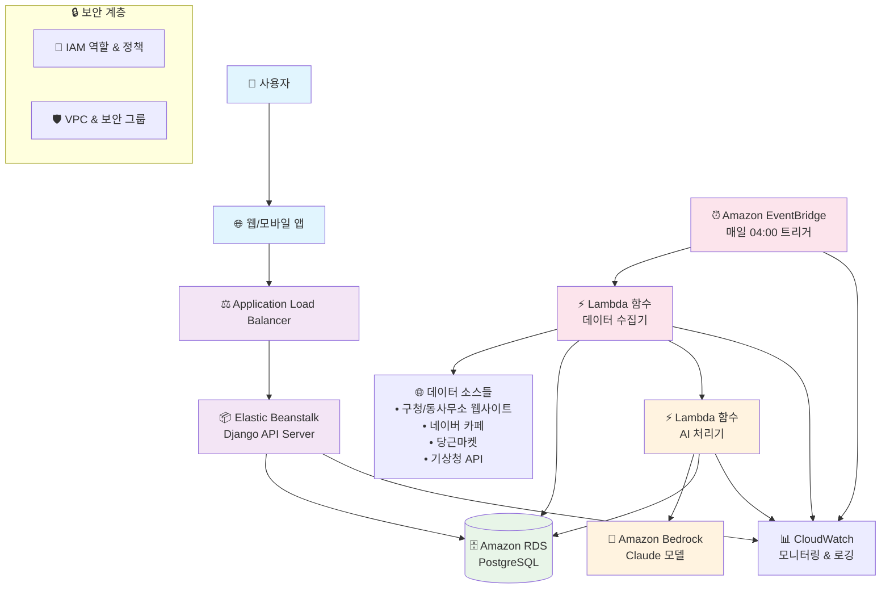

# LocalBriefing 시스템 아키텍처

## 1. 아키텍처 목표

### 핵심 설계 원칙
- **확장성**: 사용자 증가에 따른 자동 스케일링
- **운영 오버헤드 최소화**: 서버리스 우선 접근으로 인프라 관리 부담 감소
- **비용 효율성**: 사용량 기반 과금으로 초기 비용 절약
- **고가용성**: AWS 관리형 서비스 활용으로 99.9% 이상 가용성 확보
- **보안**: AWS 네이티브 보안 서비스 통합

## 2. 핵심 컴포넌트

### 2.1 API 서버 (Django 애플리케이션)
**서비스**: AWS Elastic Beanstalk
- **역할**: 사용자 인증, 브리핑 데이터 조회 API 제공
- **특징**: 
  - 자동 로드 밸런싱 및 오토 스케일링
  - 배포 자동화 및 롤백 지원
  - 애플리케이션 헬스 모니터링

### 2.2 데이터베이스
**서비스**: Amazon RDS for PostgreSQL
- **역할**: 사용자 정보, 원시 데이터, AI 요약 결과 영구 저장
- **특징**:
  - Multi-AZ 배포로 고가용성 보장
  - 자동 백업 및 포인트-인-타임 복구
  - 성능 인사이트를 통한 쿼리 최적화

### 2.3 AI 요약 서비스
**서비스**: Amazon Bedrock (Claude 모델)
- **역할**: 수집된 텍스트 데이터의 지능형 요약 및 카테고리화
- **특징**:
  - 한국어 텍스트 처리에 최적화된 Claude 모델
  - 서버리스 추론으로 사용량 기반 과금
  - 높은 처리 성능과 일관된 품질

### 2.4 스케줄링 및 백그라운드 작업
**서비스**: Amazon EventBridge + AWS Lambda
- **EventBridge**: 매일 새벽 4시 자동 트리거
- **Lambda 함수들**:
  - **데이터 수집기**: 웹 스크래핑 및 API 호출
  - **AI 처리기**: Bedrock 호출 및 결과 저장
- **특징**:
  - 완전 서버리스로 운영 비용 최소화
  - 자동 스케일링 및 오류 처리
  - CloudWatch를 통한 실시간 모니터링

## 3. 데이터 플로우 다이어그램

## 4. 아키텍처 플로우 설명

### 4.1 일일 데이터 처리 플로우
1. **트리거**: EventBridge가 매일 새벽 4시에 Lambda 데이터 수집기 실행
2. **수집**: Lambda 함수가 각종 웹사이트 및 API에서 데이터 크롤링
3. **저장**: 수집된 원시 데이터를 RDS에 임시 저장
4. **처리**: AI 처리기 Lambda가 Bedrock Claude 모델로 텍스트 요약
5. **완료**: 요약된 브리핑 데이터를 RDS에 최종 저장

### 4.2 사용자 요청 플로우
1. **접근**: 사용자가 웹/앱을 통해 브리핑 요청
2. **라우팅**: ALB가 요청을 Elastic Beanstalk 인스턴스로 분산
3. **처리**: Django API 서버가 사용자 인증 및 데이터 조회
4. **응답**: RDS에서 최신 브리핑 데이터를 가져와 JSON 형태로 반환

## 5. 비용 최적화 전략

- **서버리스 우선**: Lambda 사용으로 유휴 시간 비용 제거
- **RDS 예약 인스턴스**: 1년 약정으로 최대 60% 비용 절약
- **CloudWatch 로그 보존 정책**: 30일 보존으로 스토리지 비용 관리
- **Bedrock 사용량 모니터링**: AI 호출 최적화로 추론 비용 절감