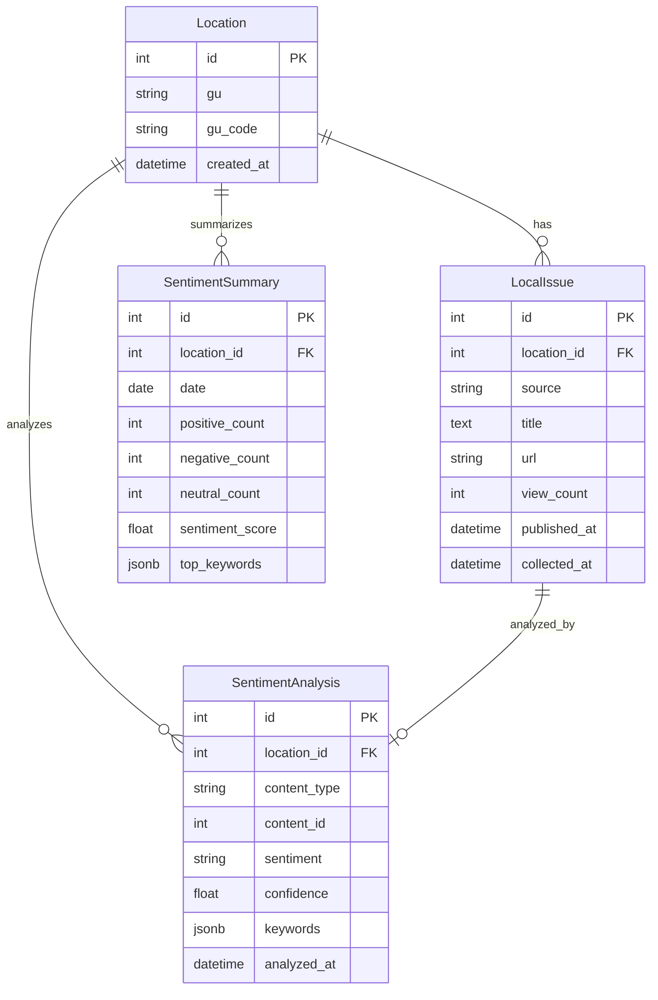
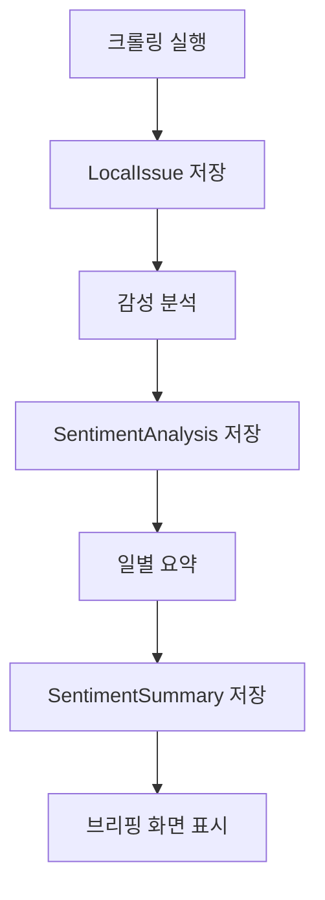

# LocalBriefing 데이터베이스 설계

## 1. 스키마 설계 철학

### 핵심 설계 원칙
- **정규화**: 데이터 중복을 최소화하고 무결성을 보장하는 3NF 정규화 적용
- **확장성**: 새로운 지역 및 데이터 소스 추가에 유연하게 대응
- **성능**: 자주 조회되는 데이터에 대한 인덱스 최적화
- **감성 분석**: 동네 이슈의 감성 온도 측정 및 분석 기능

## 2. 테이블 정의

### 2.1 Location (지역)
서울시 구 정보를 저장합니다.

| 컬럼명 | 데이터 타입 | 제약조건 | 설명 |
|--------|-------------|----------|------|
| id | SERIAL | PRIMARY KEY | 지역 고유 ID |
| gu | VARCHAR(50) | NOT NULL | 구 이름 (예: 강남구) |
| gu_code | VARCHAR(10) | | 구 행정코드 |
| created_at | TIMESTAMP | DEFAULT NOW() | 생성일시 |

### 2.2 LocalIssue (동네 이슈)
유튜브, 네이버 등에서 수집한 동네 이슈 정보를 저장합니다.

| 컬럼명 | 데이터 타입 | 제약조건 | 설명 |
|--------|-------------|----------|------|
| id | SERIAL | PRIMARY KEY | 동네 이슈 고유 ID |
| location_id | INTEGER | FOREIGN KEY | 지역 참조 |
| source | VARCHAR(20) | NOT NULL | 출처 (youtube/naver_search/naver_news) |
| title | TEXT | NOT NULL | 제목 |
| url | VARCHAR(200) | NOT NULL | 원본 URL |
| view_count | INTEGER | DEFAULT 0 | 조회수 |
| published_at | TIMESTAMP | | 게시일시 |
| collected_at | TIMESTAMP | DEFAULT NOW() | 수집일시 |

### 2.3 SentimentAnalysis (감성 분석)
동네 이슈의 감성 분석 결과를 저장합니다.

| 컬럼명 | 데이터 타입 | 제약조건 | 설명 |
|--------|-------------|----------|------|
| id | SERIAL | PRIMARY KEY | 감성 분석 고유 ID |
| location_id | INTEGER | FOREIGN KEY | 지역 참조 |
| content_type | VARCHAR(50) | NOT NULL | 콘텐츠 타입 |
| content_id | INTEGER | NOT NULL | 콘텐츠 ID |
| sentiment | VARCHAR(10) | NOT NULL | 감성 (positive/negative/neutral) |
| confidence | FLOAT | NOT NULL | 신뢰도 (0.0-1.0) |
| keywords | JSONB | DEFAULT '[]' | 추출된 키워드 |
| analyzed_at | TIMESTAMP | DEFAULT NOW() | 분석일시 |

### 2.4 SentimentSummary (감성 요약)
일별 지역 감성 온도 요약 정보를 저장합니다.

| 컬럼명 | 데이터 타입 | 제약조건 | 설명 |
|--------|-------------|----------|------|
| id | SERIAL | PRIMARY KEY | 감성 요약 고유 ID |
| location_id | INTEGER | FOREIGN KEY | 지역 참조 |
| date | DATE | NOT NULL | 날짜 |
| positive_count | INTEGER | DEFAULT 0 | 긍정 개수 |
| negative_count | INTEGER | DEFAULT 0 | 부정 개수 |
| neutral_count | INTEGER | DEFAULT 0 | 중립 개수 |
| sentiment_score | FLOAT | DEFAULT 0.0 | 감성 점수 |
| top_keywords | JSONB | DEFAULT '{}' | 주요 키워드 |

### 2.5 RawData (원시 데이터)
AI 처리 전 수집된 원본 텍스트 데이터를 저장합니다.

| 컬럼명 | 데이터 타입 | 제약조건 | 설명 |
|--------|-------------|----------|------|
| id | SERIAL | PRIMARY KEY | 원시 데이터 고유 ID |
| location_id | INTEGER | FOREIGN KEY | 지역 참조 |
| source_url | TEXT | | 데이터 출처 URL |
| category | VARCHAR(50) | NOT NULL | 데이터 카테고리 |
| title | TEXT | | 제목 |
| content | TEXT | NOT NULL | 원본 텍스트 내용 |
| collected_at | TIMESTAMP | DEFAULT NOW() | 수집일시 |
| processed | BOOLEAN | DEFAULT FALSE | AI 처리 완료 여부 |

## 3. Django Models 코드

```python
from django.db import models

class Location(models.Model):
    gu = models.CharField(max_length=50, verbose_name="구")
    gu_code = models.CharField(max_length=10, blank=True, verbose_name="구 코드")
    created_at = models.DateTimeField(auto_now_add=True)

    class Meta:
        db_table = 'locations'
        verbose_name = "지역"
        verbose_name_plural = "지역들"

    def __str__(self):
        return f"{self.gu}"

class LocalIssue(models.Model):
    SOURCE_CHOICES = [
        ('youtube', '유튜브'),
        ('naver_search', '네이버 검색'),
        ('naver_news', '네이버 뉴스'),
        ('instagram', '인스타그램'),
        ('community', '커뮤니티'),
    ]
    
    location = models.ForeignKey(Location, on_delete=models.CASCADE, verbose_name="지역")
    source = models.CharField(max_length=20, choices=SOURCE_CHOICES, verbose_name="출처")
    title = models.TextField(verbose_name="제목")
    url = models.CharField(max_length=200, verbose_name="원본 URL")
    view_count = models.IntegerField(default=0, verbose_name="조회수")
    published_at = models.DateTimeField(null=True, blank=True, verbose_name="게시일시")
    collected_at = models.DateTimeField(auto_now_add=True, verbose_name="수집일시")

    class Meta:
        db_table = 'local_issues'
        indexes = [
            models.Index(fields=['location', 'source', 'collected_at']),
            models.Index(fields=['view_count']),
        ]

class SentimentAnalysis(models.Model):
    SENTIMENT_CHOICES = [
        ('positive', '긍정'),
        ('negative', '부정'),
        ('neutral', '중립'),
    ]
    
    location = models.ForeignKey(Location, on_delete=models.CASCADE, verbose_name="지역")
    content_type = models.CharField(max_length=50, verbose_name="콘텐츠 타입")
    content_id = models.PositiveIntegerField(verbose_name="콘텐츠 ID")
    sentiment = models.CharField(max_length=10, choices=SENTIMENT_CHOICES, verbose_name="감성")
    confidence = models.FloatField(verbose_name="신뢰도")
    keywords = models.JSONField(default=list, verbose_name="추출 키워드")
    analyzed_at = models.DateTimeField(auto_now_add=True, verbose_name="분석일시")

    class Meta:
        db_table = 'sentiment_analysis'
        unique_together = ['content_type', 'content_id']
        indexes = [
            models.Index(fields=['location', 'sentiment', 'analyzed_at']),
            models.Index(fields=['content_type', 'content_id']),
        ]

class SentimentSummary(models.Model):
    location = models.ForeignKey(Location, on_delete=models.CASCADE, verbose_name="지역")
    date = models.DateField(verbose_name="날짜")
    positive_count = models.IntegerField(default=0, verbose_name="긍정 개수")
    negative_count = models.IntegerField(default=0, verbose_name="부정 개수")
    neutral_count = models.IntegerField(default=0, verbose_name="중립 개수")
    sentiment_score = models.FloatField(default=0.0, verbose_name="감성 점수")
    top_keywords = models.JSONField(default=dict, verbose_name="주요 키워드")
    
    class Meta:
        db_table = 'sentiment_summary'
        unique_together = ['location', 'date']
        indexes = [
            models.Index(fields=['location', 'date']),
        ]
    
    @property
    def total_count(self):
        return self.positive_count + self.negative_count + self.neutral_count
    
    @property
    def positive_ratio(self):
        return (self.positive_count / self.total_count * 100) if self.total_count > 0 else 0
    
    @property
    def negative_ratio(self):
        return (self.negative_count / self.total_count * 100) if self.total_count > 0 else 0

    @property
    def mood_emoji(self):
        """감성 온도에 따른 이모지"""
        if self.sentiment_temperature >= 30:
            return "🌅"  # 매우 긍정
        elif self.sentiment_temperature >= 10:
            return "☀️"   # 긍정
        elif self.sentiment_temperature >= -10:
            return "☁️"   # 중립
        elif self.sentiment_temperature >= -30:
            return "🌧️"   # 부정
        else:
            return "⛈️"   # 매우 부정
```

## 4. ERD (Entity-Relationship Diagram)



## 5. 인덱스 최적화 전략

### 주요 인덱스
- `local_issues_location_date_idx`: 지역별 날짜 조회 최적화
- `sentiment_analysis_location_date_idx`: 감성 분석 결과 조회 최적화
- `sentiment_summary_location_date_idx`: 일별 요약 조회 최적화

### 성능 고려사항
- `keywords` JSONB 필드에 GIN 인덱스 적용으로 키워드 검색 성능 향상
- 파티셔닝을 통한 대용량 데이터 관리 (월별 파티션 권장)
- 7일 이상 된 데이터 자동 정리로 성능 유지

## 6. 데이터 흐름



이 설계로 **25개 구 × 일일 크롤링 + 감성 분석**을 안정적으로 처리할 수 있습니다.