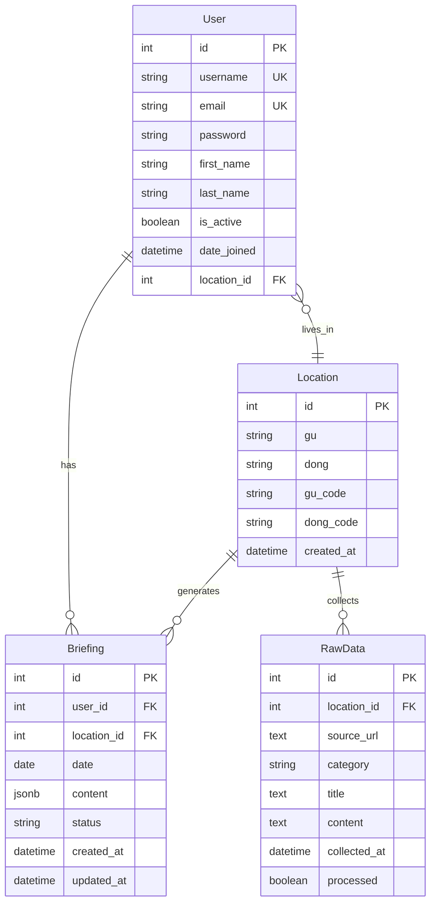

# LocalBriefing 데이터베이스 설계

## 1. 스키마 설계 철학

### 핵심 설계 원칙
- **정규화**: 데이터 중복을 최소화하고 무결성을 보장하는 3NF 정규화 적용
- **확장성**: 새로운 지역 및 데이터 소스 추가에 유연하게 대응
- **성능**: 자주 조회되는 데이터에 대한 인덱스 최적화
- **데이터 무결성**: 외래키 제약조건과 검증 로직으로 데이터 품질 보장

## 2. 테이블 정의

### 2.1 User (사용자)
사용자 인증 및 프로필 정보를 저장합니다.

| 컬럼명 | 데이터 타입 | 제약조건 | 설명 |
|--------|-------------|----------|------|
| id | SERIAL | PRIMARY KEY | 사용자 고유 ID |
| username | VARCHAR(150) | UNIQUE, NOT NULL | 사용자명 |
| email | VARCHAR(254) | UNIQUE, NOT NULL | 이메일 주소 |
| password | VARCHAR(128) | NOT NULL | 암호화된 비밀번호 |
| first_name | VARCHAR(30) | | 이름 |
| last_name | VARCHAR(150) | | 성 |
| is_active | BOOLEAN | DEFAULT TRUE | 활성 상태 |
| date_joined | TIMESTAMP | DEFAULT NOW() | 가입일시 |
| location_id | INTEGER | FOREIGN KEY | 거주지 참조 |

### 2.2 Location (지역)
서울시 구/동 정보를 저장합니다.

| 컬럼명 | 데이터 타입 | 제약조건 | 설명 |
|--------|-------------|----------|------|
| id | SERIAL | PRIMARY KEY | 지역 고유 ID |
| gu | VARCHAR(50) | NOT NULL | 구 이름 (예: 강남구) |
| dong | VARCHAR(50) | NOT NULL | 동 이름 (예: 역삼동) |
| gu_code | VARCHAR(10) | | 구 행정코드 |
| dong_code | VARCHAR(10) | | 동 행정코드 |
| created_at | TIMESTAMP | DEFAULT NOW() | 생성일시 |

### 2.3 Briefing (브리핑)
사용자별 일일 요약 브리핑을 저장합니다.

| 컬럼명 | 데이터 타입 | 제약조건 | 설명 |
|--------|-------------|----------|------|
| id | SERIAL | PRIMARY KEY | 브리핑 고유 ID |
| user_id | INTEGER | FOREIGN KEY, NOT NULL | 사용자 참조 |
| location_id | INTEGER | FOREIGN KEY, NOT NULL | 지역 참조 |
| date | DATE | NOT NULL | 브리핑 날짜 |
| content | JSONB | NOT NULL | 카테고리별 요약 내용 |
| status | VARCHAR(20) | DEFAULT 'generated' | 브리핑 상태 |
| created_at | TIMESTAMP | DEFAULT NOW() | 생성일시 |
| updated_at | TIMESTAMP | DEFAULT NOW() | 수정일시 |

### 2.4 RawData (원시 데이터)
AI 처리 전 수집된 원본 텍스트 데이터를 저장합니다.

| 컬럼명 | 데이터 타입 | 제약조건 | 설명 |
|--------|-------------|----------|------|
| id | SERIAL | PRIMARY KEY | 원시 데이터 고유 ID |
| location_id | INTEGER | FOREIGN KEY, NOT NULL | 지역 참조 |
| source_url | TEXT | | 데이터 출처 URL |
| category | VARCHAR(50) | NOT NULL | 데이터 카테고리 |
| title | TEXT | | 제목 |
| content | TEXT | NOT NULL | 원본 텍스트 내용 |
| collected_at | TIMESTAMP | DEFAULT NOW() | 수집일시 |
| processed | BOOLEAN | DEFAULT FALSE | AI 처리 완료 여부 |

### 2.5 DistrictAnnouncement (구청 공지사항)
강남구 공지사항 및 행사정보를 저장합니다.

| 컬럼명 | 데이터 타입 | 제약조건 | 설명 |
|--------|-------------|----------|------|
| id | SERIAL | PRIMARY KEY | 공지사항 고유 ID |
| location_id | INTEGER | FOREIGN KEY, NOT NULL | 지역 참조 |
| board_type | VARCHAR(50) | | 게시판 종류 (행사정보, 공지사항 등) |
| post_number | VARCHAR(20) | | 게시물 번호 |
| title | TEXT | NOT NULL | 제목 |
| content | TEXT | | 내용 (HTML 포함) |
| view_count | INTEGER | DEFAULT 0 | 조회수 |
| author | VARCHAR(100) | | 작성자 |
| department | VARCHAR(100) | | 부서명 |
| created_at | TIMESTAMP | | 등록일시 |
| collected_at | TIMESTAMP | DEFAULT NOW() | 수집일시 |

### 2.6 RestaurantInfo (음식점 정보)
강남구 음식점 인허가 정보를 저장합니다.

| 컬럼명 | 데이터 타입 | 제약조건 | 설명 |
|--------|-------------|----------|------|
| id | SERIAL | PRIMARY KEY | 음식점 정보 고유 ID |
| location_id | INTEGER | FOREIGN KEY, NOT NULL | 지역 참조 |
| management_number | VARCHAR(50) | UNIQUE | 관리번호 |
| business_type | VARCHAR(20) | | 업종 (일반음식점, 제과점, 휴게음식점) |
| license_date | DATE | | 인허가일자 |
| business_status_code | VARCHAR(10) | | 영업상태코드 |
| business_status_name | VARCHAR(50) | | 영업상태명 |
| business_name | VARCHAR(200) | | 사업장명 |
| phone_number | VARCHAR(20) | | 전화번호 |
| area_size | DECIMAL(10,2) | | 소재지면적 |
| postal_code | VARCHAR(10) | | 우편번호 |
| road_address | TEXT | | 도로명주소 |
| lot_address | TEXT | | 지번주소 |
| coordinate_x | DECIMAL(15,10) | | X좌표 |
| coordinate_y | DECIMAL(15,10) | | Y좌표 |
| collected_at | TIMESTAMP | DEFAULT NOW() | 수집일시 |

## 3. Django Models.py 코드

```python
from django.db import models
from django.contrib.auth.models import AbstractUser
from django.utils import timezone

class Location(models.Model):
    gu = models.CharField(max_length=50, verbose_name="구")
    dong = models.CharField(max_length=50, verbose_name="동")
    gu_code = models.CharField(max_length=10, blank=True, verbose_name="구 코드")
    dong_code = models.CharField(max_length=10, blank=True, verbose_name="동 코드")
    created_at = models.DateTimeField(auto_now_add=True)

    class Meta:
        db_table = 'locations'
        unique_together = ['gu', 'dong']
        verbose_name = "지역"
        verbose_name_plural = "지역들"

    def __str__(self):
        return f"{self.gu} {self.dong}"

class User(AbstractUser):
    location = models.ForeignKey(
        Location, 
        on_delete=models.SET_NULL, 
        null=True, 
        blank=True,
        verbose_name="거주지"
    )

    class Meta:
        db_table = 'users'
        verbose_name = "사용자"
        verbose_name_plural = "사용자들"

class RawData(models.Model):
    CATEGORY_CHOICES = [
        ('weather', '날씨'),
        ('district_news', '구/동 공지사항'),
        ('community', '커뮤니티 이슈'),
        ('secondhand', '중고거래'),
        ('restaurants', '맛집'),
        ('local_news', '지역 뉴스'),
    ]

    location = models.ForeignKey(Location, on_delete=models.CASCADE, verbose_name="지역")
    source_url = models.TextField(blank=True, verbose_name="출처 URL")
    category = models.CharField(max_length=50, choices=CATEGORY_CHOICES, verbose_name="카테고리")
    title = models.TextField(blank=True, verbose_name="제목")
    content = models.TextField(verbose_name="내용")
    collected_at = models.DateTimeField(auto_now_add=True, verbose_name="수집일시")
    processed = models.BooleanField(default=False, verbose_name="처리 완료")

    class Meta:
        db_table = 'raw_data'
        indexes = [
            models.Index(fields=['location', 'category', 'collected_at']),
            models.Index(fields=['processed']),
        ]
        verbose_name = "원시 데이터"
        verbose_name_plural = "원시 데이터들"

    def __str__(self):
        return f"{self.location} - {self.category} - {self.collected_at.date()}"

class Briefing(models.Model):
    STATUS_CHOICES = [
        ('generating', '생성 중'),
        ('generated', '생성 완료'),
        ('failed', '생성 실패'),
    ]

    user = models.ForeignKey(User, on_delete=models.CASCADE, verbose_name="사용자")
    location = models.ForeignKey(Location, on_delete=models.CASCADE, verbose_name="지역")
    date = models.DateField(verbose_name="브리핑 날짜")
    content = models.JSONField(verbose_name="브리핑 내용")
    status = models.CharField(max_length=20, choices=STATUS_CHOICES, default='generated', verbose_name="상태")
    created_at = models.DateTimeField(auto_now_add=True, verbose_name="생성일시")
    updated_at = models.DateTimeField(auto_now=True, verbose_name="수정일시")

    class Meta:
        db_table = 'briefings'
        unique_together = ['user', 'date']
        indexes = [
            models.Index(fields=['user', 'date']),
            models.Index(fields=['location', 'date']),
        ]
        verbose_name = "브리핑"
        verbose_name_plural = "브리핑들"

    def __str__(self):
        return f"{self.user.username} - {self.date}"

class DistrictAnnouncement(models.Model):
    location = models.ForeignKey(Location, on_delete=models.CASCADE, verbose_name="지역")
    board_type = models.CharField(max_length=50, blank=True, verbose_name="게시판 종류")
    post_number = models.CharField(max_length=20, blank=True, verbose_name="게시물 번호")
    title = models.TextField(verbose_name="제목")
    content = models.TextField(blank=True, verbose_name="내용")
    view_count = models.IntegerField(default=0, verbose_name="조회수")
    author = models.CharField(max_length=100, blank=True, verbose_name="작성자")
    department = models.CharField(max_length=100, blank=True, verbose_name="부서명")
    created_at = models.DateTimeField(null=True, blank=True, verbose_name="등록일시")
    collected_at = models.DateTimeField(auto_now_add=True, verbose_name="수집일시")

    class Meta:
        db_table = 'district_announcements'
        indexes = [
            models.Index(fields=['location', 'created_at']),
            models.Index(fields=['board_type']),
        ]
        verbose_name = "구청 공지사항"
        verbose_name_plural = "구청 공지사항들"

    def __str__(self):
        return f"{self.location} - {self.title[:50]}"

class RestaurantInfo(models.Model):
    BUSINESS_TYPE_CHOICES = [
        ('general', '일반음식점'),
        ('bakery', '제과점'),
        ('cafe', '휴게음식점'),
    ]

    location = models.ForeignKey(Location, on_delete=models.CASCADE, verbose_name="지역")
    management_number = models.CharField(max_length=50, unique=True, verbose_name="관리번호")
    business_type = models.CharField(max_length=20, choices=BUSINESS_TYPE_CHOICES, verbose_name="업종")
    license_date = models.DateField(null=True, blank=True, verbose_name="인허가일자")
    business_status_code = models.CharField(max_length=10, blank=True, verbose_name="영업상태코드")
    business_status_name = models.CharField(max_length=50, blank=True, verbose_name="영업상태명")
    business_name = models.CharField(max_length=200, blank=True, verbose_name="사업장명")
    phone_number = models.CharField(max_length=20, blank=True, verbose_name="전화번호")
    area_size = models.DecimalField(max_digits=10, decimal_places=2, null=True, blank=True, verbose_name="소재지면적")
    postal_code = models.CharField(max_length=10, blank=True, verbose_name="우편번호")
    road_address = models.TextField(blank=True, verbose_name="도로명주소")
    lot_address = models.TextField(blank=True, verbose_name="지번주소")
    coordinate_x = models.DecimalField(max_digits=15, decimal_places=10, null=True, blank=True, verbose_name="X좌표")
    coordinate_y = models.DecimalField(max_digits=15, decimal_places=10, null=True, blank=True, verbose_name="Y좌표")
    collected_at = models.DateTimeField(auto_now_add=True, verbose_name="수집일시")

    class Meta:
        db_table = 'restaurant_info'
        indexes = [
            models.Index(fields=['location', 'business_type']),
            models.Index(fields=['business_status_code']),
            models.Index(fields=['license_date']),
        ]
        verbose_name = "음식점 정보"
        verbose_name_plural = "음식점 정보들"

    def __str__(self):
        return f"{self.business_name} ({self.business_type})"
```

## 4. ERD (Entity-Relationship Diagram)



## 5. 인덱스 최적화 전략

### 주요 인덱스
- `briefings_user_date_idx`: 사용자별 날짜 조회 최적화
- `raw_data_location_category_collected_idx`: 지역별 카테고리 데이터 수집 최적화
- `raw_data_processed_idx`: 미처리 데이터 조회 최적화

### 성능 고려사항
- `content` JSONB 필드에 GIN 인덱스 적용으로 JSON 쿼리 성능 향상
- 파티셔닝을 통한 대용량 데이터 관리 (월별 파티션 권장)